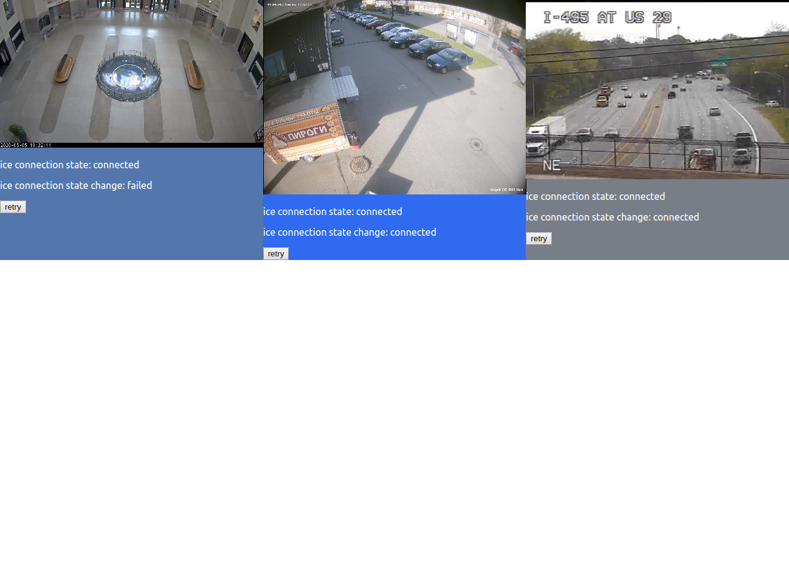

# rtsp-webrtc-client

This is a react client app for [creimers/RTSPtoWebRTC](https://github.com/creimers/RTSPtoWebRTC).

## installation

`yarn install`

## usage

`yarn start`

## screenshot

This project was bootstrapped with [Create React App](https://github.com/facebook/create-react-app).
